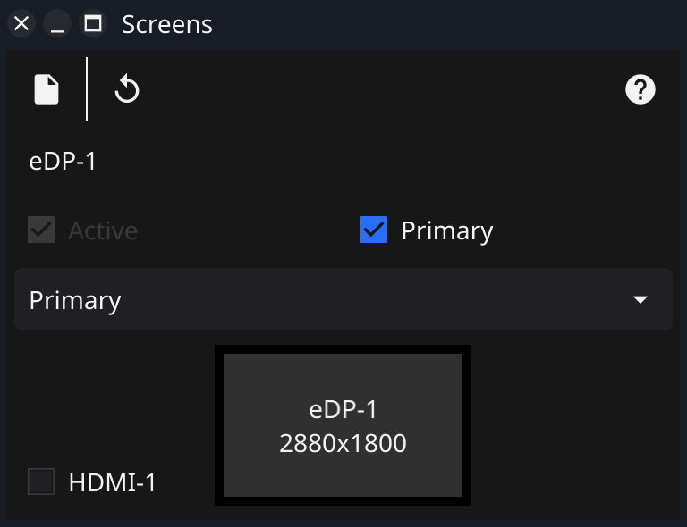
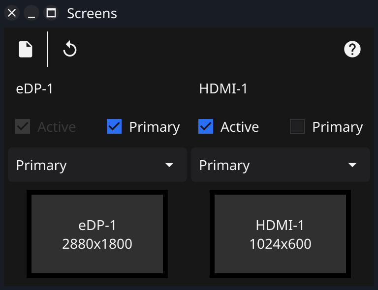

# Screens

A basic screen manager app for Linux built using [Apptrix.ai](https://apptrix.ai),
Fyne and the Go programming language.

This is a heavy work in progress, TODO list looks like:

-[ ] Display the screens arrangement in one visual
-[ ] Support mirroring
-[ ] Handle different arrangements

## Screenshots

